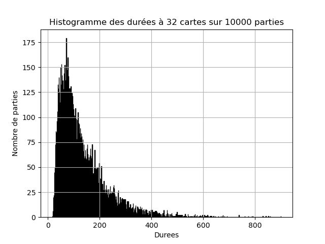
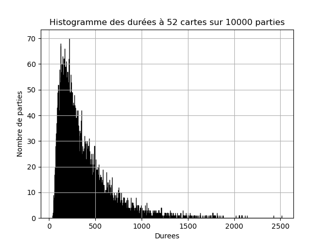

# War Card Game - La Bataille ouverte

Cette page contient le code correspondant à l'article *Les défis du jeu de la bataille* de la revue [Pour La Science](https://www.pourlascience.fr/) (PLS 565 - nov 2024) et reprend les résultats de l'ancien article (PLS215, sept 1995).

Le jeu de la bataille, joué dans le monde entier est sans doute le plus simple des jeux de cartes. Il regorge néanmoins de nombreux mystères notamment sur les records de longueur de parties ou l'existance de cycles.
Le code ci-dessous est le code qui a permi d'établir les records cités dans l'article.

Existe t-il des parties infinies à la bataille française ouverte (sans carte à l'envers) ? Nous avons trouvé en 1995 une solution positive pour 32 cartes avec rangement naturel, mais pas pour les 3 autres (32 cartes optimisé, 52 cartes naturel et optimisé).
C'est un vrai défi ! 

 

## Biblio
- [JP Delahaye - P Mathieu. Pour la Science 215, sept 1995](https://www.cristal.univ-lille.fr/~jdelahay/pls/1995/030.pdf)
- [M Mayer - Github "Beggar my Neighbour](https://github.com/matthewmayer/beggarmypython)
- [M Paulhus - Beggar My Neighbour. The American Mathematical Monthly, 106(2), pp162–165](https://www.tandfonline.com/doi/abs/10.1080/00029890.1999.12005024)
- [M Spivey - Cycles in war, INTEGERS 10, pp 747-764, 2010](https://www.emis.de/journals/INTEGERS/papers/kg2/kg2.pdf)
- [Wikipedia EN](https://en.wikipedia.org/wiki/War_(card_game))
- [Wikipedia FR](https://fr.wikipedia.org/wiki/Bataille_(jeu))
